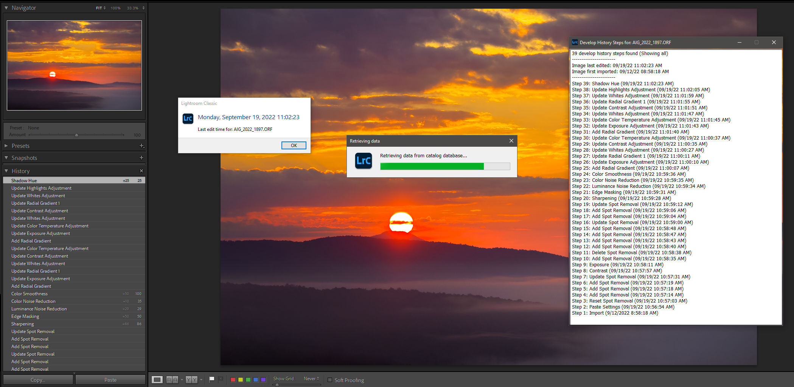

# Lightroom Develop History Steps Timestamps

An Adobe Lightroom Classic CC plugin that queries the Lightroom catalog (.lrcat file) and displays date and time information for an image's develop history steps or edit time.

- [Introduction](#introduction)
- [Disclaimer](#warning-and-a-little-disclaimer)
- [Installation](#installation)
- [Usage & Features](#usage--features)
- [Known Issues](#known-issues)

## Introduction

Lightroom Classic maintains timestamps for every develop history step and a separate counter and timestamp for all other metadata changes, but this information is mostly hidden and inaccessible to the user.

For Develop History steps, every step has a timestamp associated with it in the catalog/database, but timestamps are only displayed in the History panel for specific steps or actions: Import, Export, Print and Edited in external app, like Photoshop.

For metadata changes, Lightroom maintains a separate counter that gets increased and timestamped with any changes in an image's metadata (flag status, star rating, color label, keywords, etc.), including any develop module changes. This counter is used when sorting images by "Edit Time", but there is no way to see the associated date/time information anywhere. So you can know which image was last edited, but not WHEN.

A discussion on this topic and the need for seeing the timestamps exists in the Adobe Community forums: [Timestamp in LR history for every command](https://community.adobe.com/t5/lightroom-ecosystem-cloud-based-discussions/timestamp-in-lr-history-for-every-command/td-p/11500328).

## WARNING (and a little disclaimer)

BEFORE USING THIS PLUGIN, IT IS HIGHLY RECOMMENDED YOU MAKE A BACKUP COPY OF YOUR CATALOG AND MAINTAIN A REGULAR BACKUP OF YOUR CATALOG AT ALL TIMES.

PLEASE NOTE: This is my first Lightroom plugin that retrieves information from Lightroom's catalog file using (simple) methods that are not supported by the Lightroom SDK, since the SDK doesn't offer any functions/methods/mechanisms to retrieve this information. 

The plugin fetches timestamps using simple SQL(ite) SELECT queries on specific tables of the catalog, which is basically an SQLite database. Since these queries run regardless of the "lock" Lightroom sets on the catalog file,  this MAY lead to catalog corruption and, therefore, data loss. I am open to further discussion on this topic if more experienced developers want to chime in and offer advice and possible enhancements to the query mechanism.

That said, there have been no problems to date, as far as I know. 

## Installation

- Download the latest release zip archive from Github and extract to a folder of your choice.
- In Ligthroom, go to File > Plug-in Manager and click Add.
- Browse to the folder where you extracted the zip archive and select the DevelopHistoryTimestamps.lrplugin folder.
- Make sure you've read the WARNING section above.

## Usage & Features

The plugin adds three new options to File > Plug-in Extras and Library > Plug-in Extras:

- View Develop History Timestamps
- View Last Develop Time
- View Edit Time

To use, select a photo and then choose one of options above from File > Plug-in Extras (works from either Library or Develop module), or from Library > Plug-in Extras while in Library module or Loupe view.

### View Develop History Timestamps
View Develop History Timestamps retrieves the date and time of all Develop History steps of an image in a floating window.

These are the same steps displayed in the Develop Module > History panel for any given image, with the addition of their respective timestamp at the end.

In addition to the all the timestamped history steps, the window will also show the total number of steps, the timestamp of when a file was first imported or first created for virtual copies (first history step) and when it was last edited in the Develop module (timestamp of the most recent history step). This is simply for convenience.

You may open multiple Develop History Steps windows by leaving the window open and getting the timestamps for other images.

For images that have numerous history steps (some can reach hundreds of steps), only the most recent 50 steps will be visible. To see the rest, click inside the window and drag down to see all entries or click inside the window and use Ctrl/Cmd + A to select all for copying and pasting elsewhere.

### View Last Develop Time
View Last Develop Time retrieves the date and time of the last Develop History step of an image (also shown using the View Develop History Timestamps option). This is different from Lightroom's regular Edit Time timestamp, which also accounts for any changes to an image in regards to flagging, star rating, color labeling, keywording and maybe other metadata. 

Using this option can be useful when working with older images which may have been "developed" at a certain time, but managed (flagged, rated, labeled, keyworded) at a very different time. 

For example:

1. You visited Death Valley in March of 2016 to photograph the wild flowers super-bloom.
2. You processed your images in April 2016 and shared them all over social media. Your mom liked them all.
3. A few years passed while you photographed other things in other places.
4. The pandemic striked and there's nowhere to go. You stayed home and decided to look back on your Death Valley Wild Flowers Super-Bloom 2016 images and tackle the daunting task of keywording them. 
5. You did so exceptionally well, but then realized that now your reverse sorting by "Edit Time" didn't mean anything anymore, because the keywording affected the "edit" time.
6. You wondered if there's any way to find out when you last made develop changes to an image, since the last develop history step of "Saturation +65" lacks a date next to it. 

### View Edit Time
View Edit Time retrieves the date and time of Lightroom's regular Edit Time timestamp, which is used behind the scenes to sort images in the Library module (or filmstrip) by "Edit Time", but is not shown anywhere.

The Edit Time is maintained by Lightroom separately from the develop history steps and is updated automatically with any changes to an image in regards to flagging, star rating, color labeling, keywording and maybe other metadata, including any develop module edits to the image. 

Using this option can be useful when you want to know the date and time when ANY change was made to an image, not just develop module changes.

## Known Issues

- Opening multiple floating windows works best on setups with multiple screens.
- On single screen setups in Windows, the floating window may stay hidden behind the main Lightroom window once it loses focus. This most commonly happens when the image is opened in the Develop module. To fix this:

1. Press "E" in Lightroom to switch to Library module.
2. (or) Try double clicking the window in your taskbar.
